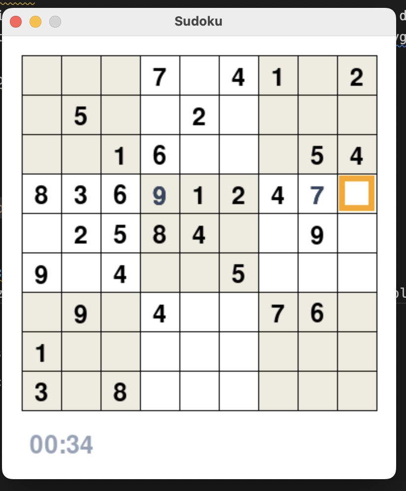

# Sudoku #
## Description: ##
This project is a Sudoku game with a built in puzzle generator, displayed with an interactive graphics window. Everything has been programmed in Python and uses the Pygame library.



## Usage

```sh
python -m pip install pygame
python3 main.py
```

## Generation: ##
The sudoku puzzle for the game is generated as a complete solvable array with no blank spots. Then random postitions are erased by rewriting it with a 0, until the puzzle is less than trivial. The result does not return a soduku puzzle with one solution, so the program manually checks every user input when playing.

## Credit: ##
This program was made using the backtracking algorithm adapted from TechWithTim. I got very close to generating a solvable sudoku puzzle, but I was unable to implement proper backtracking until I learned about it on YouTube.